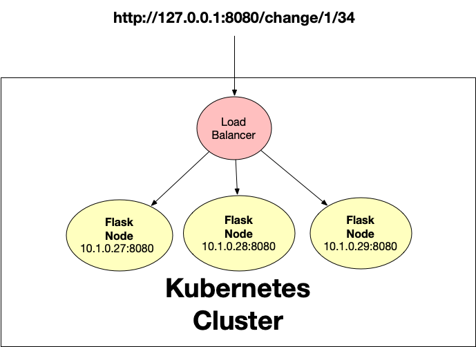
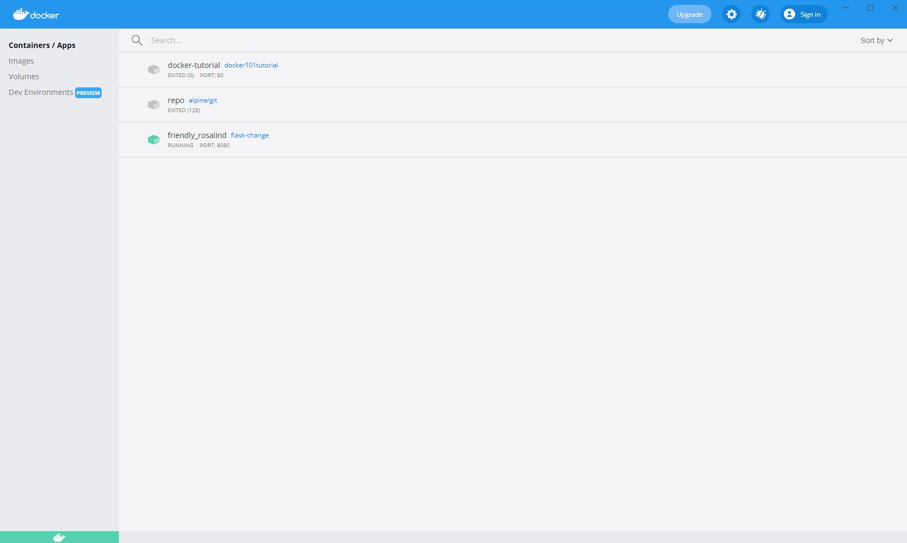
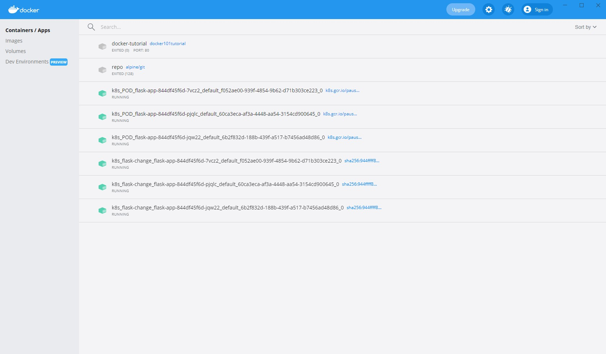

[](https://github.com/ptdriscoll/kubernetes-flask-app/actions/workflows/main.yml)

# kubernetes-flask-app
A Kubernetes Flask microservice that returns the correct amount of change.



### Get started

1. Clone this GitHub repo, and cd into the directory:

```
git clone https://github.com/ptdriscoll/kubernetes-flask-app.git
```
```
cd kubernetes-flask-app
```

2. Create and source Python virtual environment:

```
python -m venv ~/.kubernetes-flask-app
```
Unix/macOS: `source ~/.kubernetes-flask-app/bin/activate`  
Windows: `. ~/.kubernetes-flask-app/Scripts/activate`

3. Install Python libraries, lint and test by running `make all` or:

```
pip install --upgrade pip &&\
		pip install -r requirements.txt
```
```
docker run --rm -i hadolint/hadolint < Dockerfile
```
```
pylint --disable=R,C,W1203,W0702 app.py
```
```
python -m pytest -vv --cov=app app_test.py
```

4. Run the app:

```
python app.py
```

5. Open the app at [http://127.0.0.1:8080](http://127.0.0.1:8080). Here's a [sample request](http://127.0.0.1:8080/change/1/34). 

### Build and run Docker container



1. Install, open and start [Docker Desktop](https://www.docker.com/products/docker-desktop)

2. Build the image locally by running `make build` or:

```
docker build -t flask-change:latest . 
```

3. Verify container by running `docker image ls`

4. Run by using `make run` or:

```
docker run -p 8080:8080 flask-change
``` 

5. In a separate terminal, invoke the web page using `make invoke` or: 

```
curl http://127.0.0.1:8080/change/1/34
```

6. Stop running the container:
    - First get the container id: `docker ps -a`
	- Then run: `docker stop <container-id>`
	- And remove: `docker rm -f <container-id>`
	
### Run Kubernetes locally

	

1. Make sure Kubernetes is enabled in Docker Desktop under Settings>Kubernetes  

2. Verify Kubernetes is working via docker-desktop context:

```
kubectl get nodes
```

3. Set up the load balance service and run the application in Kubernetes by running `make run-kube` or:

```
kubectl apply -f kube.yaml
```

4. Verify the container is running with `kubectl get pods`

5. Describe the balanced service:

```
kubectl describe services kubernetes-flask-app
```

6. Invoke the web page using `make invoke` or: 

```
curl http://127.0.0.1:8080/change/1/34
```

### Cleanup

1. Cleanup the deployment: 

```
kubectl delete deployment flask-app
```

2. Remove the Python virtual environment:

```
deactivate
```
```
rm -rf ~/.kubernetes-flask-app
```

### References

- [Kubernetes deployment strategy](https://azure.microsoft.com/en-us/overview/kubernetes-deployment-strategy/)
- [Use a Service to Access an Application in a Cluster](https://kubernetes.io/docs/tasks/access-application-cluster/service-access-application-cluster/)
- [Get started with Kubernetes (using Python)](https://kubernetes.io/blog/2019/07/23/get-started-with-kubernetes-using-python/)
- [Docker Desktop](https://www.docker.com/products/docker-desktop)
- [GitHub: Kubernetes Hello World](https://github.com/noahgift/kubernetes-hello-world-python-flask)
- [GitHub: flask-change-microservice](https://github.com/noahgift/flask-change-microservice)
- [Installing packages using pip and virtual environments](https://packaging.python.org/guides/installing-using-pip-and-virtual-environments/)
